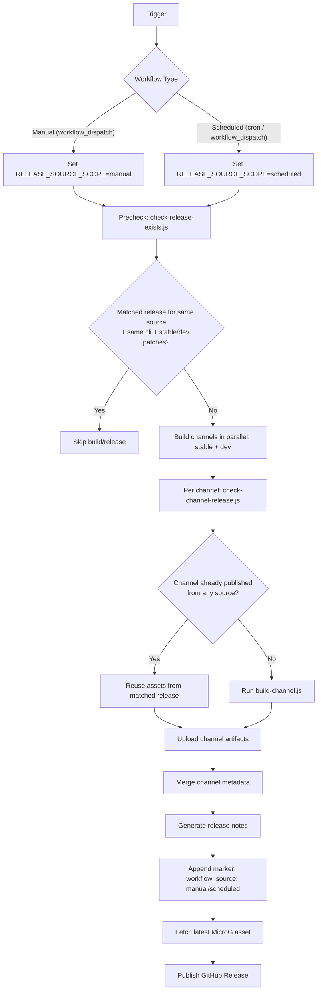

# Morphe Auto APK Patch

Automatically downloads APKs, fetches patches, runs morphe-cli, and outputs patched APK files.

For Traditional Chinese documentation, see [README.zh-TW.md](./README.zh-TW.md).

## Quick Start
1. Requirements
- Node.js 18+
- Java 21+
- `curl`

2. Install dependencies
```bash
npm ci
```

3. Prepare config and keystore
- Edit `config.toml`
- Put `morphe-test.keystore` in the project root for local runs

4. Run
```bash
node ./main.js --config ./config.toml
```

5. Output
- Data is stored under workspace (default: OS user data folder):
  - Windows: `%LOCALAPPDATA%/MorphePatcher/workspace`
  - macOS: `~/Library/Application Support/MorphePatcher/workspace`
  - Linux: `~/.local/share/MorphePatcher/workspace`
- Task folder: `<workspace>/output/task-<timestamp>-<pid>/`
- Task log: `<workspace>/output/task-<...>/task.log`
- Task info: `<workspace>/output/task-<...>/task-info.json`
- Patched APKs: `<workspace>/output/task-<...>/<app>/`
- Build metadata: `<workspace>/output/task-<...>/release-metadata.json`
- Override workspace: `--workspace <path>` or `MORPHE_WORKSPACE=/path`
- Migrate legacy root folders once: `--migrate-workspace`

## Minimal Config Example
```toml
[morphe-cli]
patches_repo = "MorpheApp/morphe-cli"
mode = "stable" # stable / dev / local
path = ""

[patches]
patches_repo = "MorpheApp/morphe-patches"
mode = "stable" # stable / dev / local
path = ""

[signing]
keystore_path = "./workspace/keystore/morphe-test.keystore"

[youtube]
mode = "remote" # remote / local / false
package_name = "com.google.android.youtube"
```

## CI Workflows
- Manual build and release: `.github/workflows/release.yml`
- Scheduled build and release: `.github/workflows/scheduled-build.yml`

## Desktop App (IPC)
Desktop UI is now Electron-only and communicates through IPC (no standalone web-api server):
- Renderer: `desktop/web/` (Vite + React)
- Bridge: `desktop/preload.js` + `desktop/ipc/handlers.js`
- Core execution: still `main.js` CLI child process

Renderer structure (kept intentionally simple):
- `desktop/web/src/App.jsx`: orchestration only (state + action wiring)
- `desktop/web/src/pages/*`: page-level UI
- `desktop/web/src/features/*`: large dialogs/feature blocks
- `desktop/web/src/services/*`: IPC-facing service wrappers
- `desktop/web/src/stores/*`: shared UI state only (`uiStore`, `dialogStore`)

Commands:
- `npm run web:build`
- `npm run desktop:install` (install Electron-only dependencies under `desktop/`)
- `npm run desktop:dev` (desktop dev mode: web-ui + electron, with hot reload)
- `npm run desktop:start` (build UI + open Electron desktop app)
- `npm run desktop:pack` (build Windows portable exe via electron-builder)

Detailed architecture: [docs/desktop.md](./docs/desktop.md)
CLI options: [docs/cli.md](./docs/cli.md)
TOML fields: [docs/toml.md](./docs/toml.md)

## CI/CD Flow


Summary:
- Precheck is separated by `workflow_source` (manual/scheduled).
- Channel asset reuse checks all existing releases (not separated by source).
- Stable and dev channels are handled independently, then merged into one release.

## Run In Your Own Fork
1. Fork this repository.
2. Go to `Settings -> Actions -> General`:
- Enable Actions
- Set `Workflow permissions` to `Read and write permissions` (required for manual release)
3. (Optional) Add this secret in `Settings -> Secrets and variables -> Actions`:
- `MORPHE_KEYSTORE_BASE64`
4. If `MORPHE_KEYSTORE_BASE64` is not set, workflows will use `morphe-test.keystore` in the repository.
5. Open the `Actions` tab:
- Run `Manual Build And Release APK` for release publishing
- Or enable `Scheduled Build And Release APK` for periodic publishing
