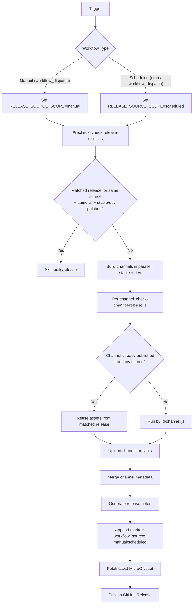

# Morphe Auto APK Patch

Automatically downloads APKs, fetches patches, runs morphe-cli, and outputs patched APK files.

For Traditional Chinese documentation, see [README.zh-TW.md](./README.zh-TW.md).

## Quick Start
1. Requirements
- Node.js 18+
- Java 21+
- `curl`

2. Install dependencies
```bash
npm ci
```

3. Prepare config and keystore
- Edit `config.toml`
- Put `morphe-test.keystore` in the project root for local runs

4. Run
```bash
node ./main.js --config ./config.toml
```

5. Output
- Each run creates a task folder: `output/task-<timestamp>-<pid>/`
- Task log: `output/task-<...>/task.log`
- Task info: `output/task-<...>/task-info.json`
- Patched APKs: `output/task-<...>/<app>/`
- Build metadata (full patch flow): `output/task-<...>/release-metadata.json`

## Minimal Config Example
```toml
[morphe-cli]
patches_repo = "MorpheApp/morphe-cli"

[patches]
patches_repo = "MorpheApp/morphe-patches"
mode = "stable"

[youtube]
apk = "remote"
```

## CI Workflows
- Manual build and release: `.github/workflows/release.yml`
- Scheduled build and release: `.github/workflows/scheduled-build.yml`

## CI/CD Flow


Summary:
- Precheck is separated by `workflow_source` (manual/scheduled).
- Channel asset reuse checks all existing releases (not separated by source).
- Stable and dev channels are handled independently, then merged into one release.

## Run In Your Own Fork
1. Fork this repository.
2. Go to `Settings -> Actions -> General`:
- Enable Actions
- Set `Workflow permissions` to `Read and write permissions` (required for manual release)
3. (Optional) Add this secret in `Settings -> Secrets and variables -> Actions`:
- `MORPHE_KEYSTORE_BASE64`
4. If `MORPHE_KEYSTORE_BASE64` is not set, workflows will use `morphe-test.keystore` in the repository.
5. Open the `Actions` tab:
- Run `Manual Build And Release APK` for release publishing
- Or enable `Scheduled Build And Release APK` for periodic publishing
