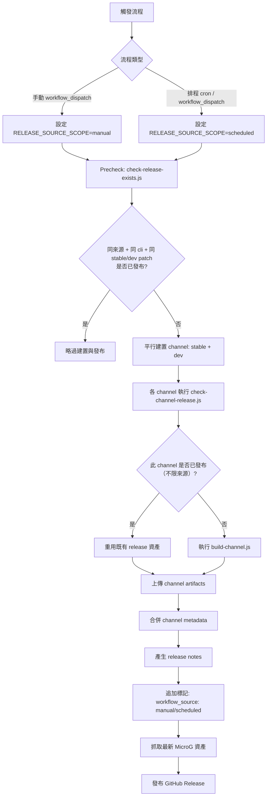

# Morphe Auto APK Patch

自動下載 APK、抓取 patch、執行 morphe-cli 打包，輸出 patched APK。

英文版本請參考 [README.md](./README.md)。

## 快速開始
1. 安裝需求
- Node.js 18+
- Java 21+
- `curl`

2. 安裝套件
```bash
npm ci
```

3. 準備設定與簽章檔
- 編輯 `config.toml`
- 本地測試請放置 `morphe-test.keystore` 於專案根目錄

4. 執行
```bash
node ./main.js --config ./config.toml
```

5. 結果位置
- 資料會存放到 workspace（預設為系統使用者資料夾）：
  - Windows：`%LOCALAPPDATA%/MorphePatcher/workspace`
  - macOS：`~/Library/Application Support/MorphePatcher/workspace`
  - Linux：`~/.local/share/MorphePatcher/workspace`
- 每次執行會建立任務資料夾：`<workspace>/output/task-<timestamp>-<pid>/`
- 任務 log：`<workspace>/output/task-<...>/task.log`
- 任務資訊：`<workspace>/output/task-<...>/task-info.json`
- 輸出 APK：`<workspace>/output/task-<...>/<app>/`
- 建置資訊（完整 patch 流程）：`<workspace>/output/task-<...>/release-metadata.json`
- 可用 `--workspace <path>` 或 `MORPHE_WORKSPACE` 覆寫 workspace
- 可用 `--migrate-workspace` 一次性遷移舊根目錄資料夾

## 最小設定範例
```toml
[morphe-cli]
patches_repo = "MorpheApp/morphe-cli"
mode = "stable" # stable / dev / local
path = ""

[patches]
patches_repo = "MorpheApp/morphe-patches"
mode = "stable" # stable / dev / local
path = ""

[youtube]
mode = "remote" # remote / local / false
```

## CI Workflows
- 手動發布：`.github/workflows/release.yml`
- 定時建置並發布：`.github/workflows/scheduled-build.yml`

## 桌面版（IPC）
現在只保留 Electron 桌面端，透過 IPC 溝通（不再使用獨立 `web-api`）：
- 前端：`desktop/web/`（Vite + React）
- 溝通層：`desktop/preload.js` + `desktop/ipc/handlers.js`
- 核心流程：仍由 `main.js` CLI 執行

前端結構（維持適度拆分，不過度切碎）：
- `desktop/web/src/App.jsx`：流程協調（狀態與動作串接）
- `desktop/web/src/pages/*`：頁面層 UI
- `desktop/web/src/features/*`：較大的功能區塊 / 對話框
- `desktop/web/src/services/*`：IPC 呼叫封裝
- `desktop/web/src/stores/*`：共享 UI 狀態（`uiStore`、`dialogStore`）

指令：
- `npm run web:build`
- `npm run desktop:install`（只安裝 `desktop/` 內 Electron 依賴）
- `npm run desktop:dev`（桌面 dev 模式：`web-ui + electron`，支援熱更新）
- `npm run desktop:start`（先建置 UI，再啟動 Electron 桌面版）
- `npm run desktop:pack`（用 electron-builder 打包 Windows portable exe）

詳細架構： [docs/desktop.md](./docs/desktop.md)

## CI/CD 流程


摘要：
- Precheck 會依 `workflow_source`（manual/scheduled）分開檢查。
- Channel 資產重用會跨所有既有 release 檢查（不分來源）。
- stable/dev 會各自處理，最後合併成同一次發布。

## Fork 後如何自己跑
1. Fork 專案到自己的 GitHub 倉庫。
2. 到 `Settings -> Actions -> General`：
- 開啟 Actions（允許 workflow 執行）
- `Workflow permissions` 設為 `Read and write permissions`（手動發布需要）
3. 到 `Settings -> Secrets and variables -> Actions` 新增（可選）：
- `MORPHE_KEYSTORE_BASE64`
4. 如果沒設定 `MORPHE_KEYSTORE_BASE64`，workflow 會自動使用倉庫內的 `morphe-test.keystore`。
5. 進入 `Actions` 頁面：
- 手動執行 `Manual Build And Release APK` 進行發布
- 或啟用 `Scheduled Build And Release APK` 等待排程自動發布
